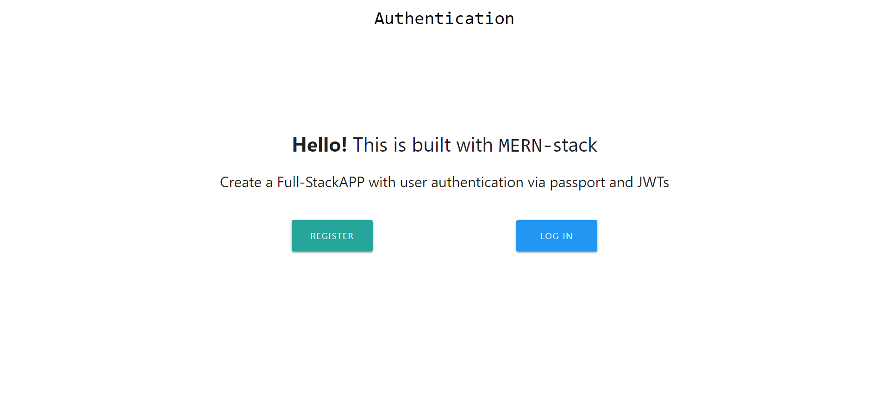
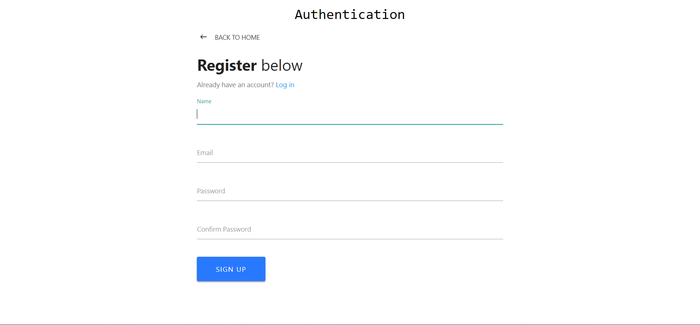
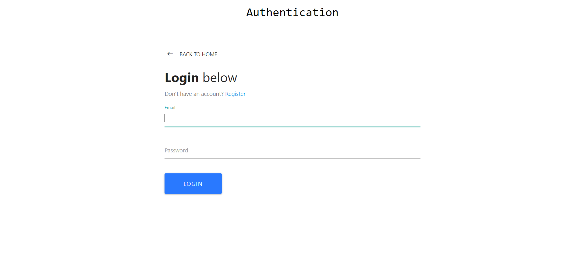
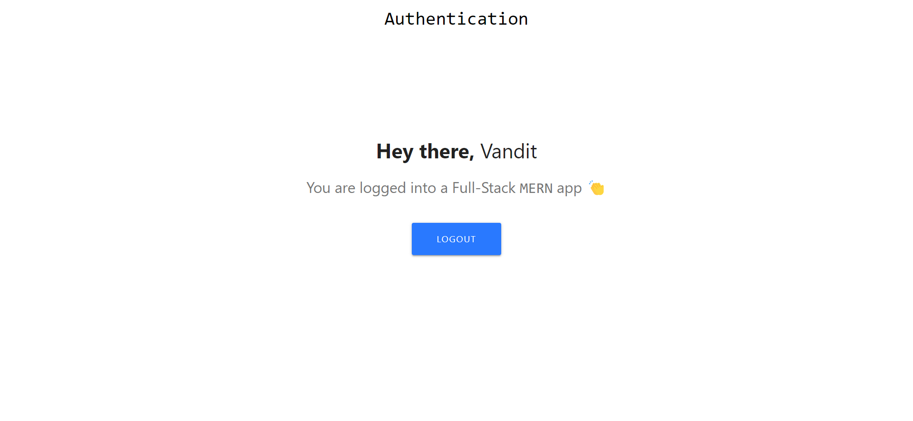
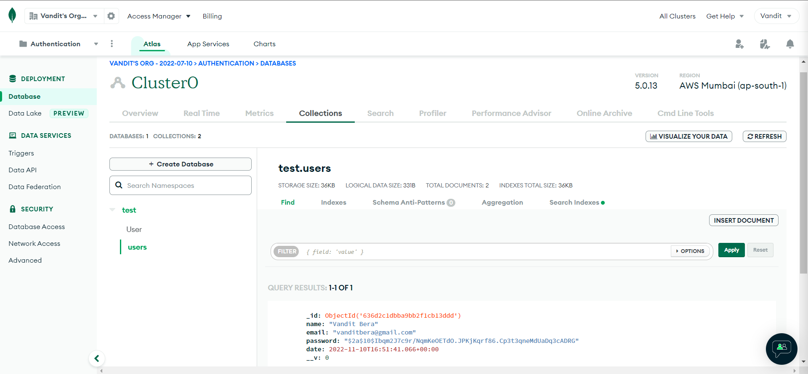

<!-- Intro -->
# All About MERN-Stack Authentication

<!-- PROJECT LOGO -->
 

  

<h3 align="center">Authentication using MERN-Stack</h3>

  

<!-- ABOUT THE PROJECT -->

 

## ⭐ About The Project

In this Project I've create a Authentication Application Using MERN-Stack. First User is in Home page end I've create two option for Login & Registration After Registration user is go to the login and see the Dashboard.

 

## ⚪ How to Start

### Step 1: First Download this project.
### Step 2: Open Terminal and write 'npm install' command to install the node_modules of the back-end part.
### Step 3: Open Terminal and write 'cd client' and then write 'npm install' command to install the node_modules of the front-end part.
### Step 4: Open Terminal and write 'cd ..' to back the directory.
### Step 5: Now you write 'npm run dev' command to run the entire project.
### Step 6: Now you write 'npm run dev' command to run the entire project.
### Step 7: And Now you are got to the browser end write 'localhost:3000' command to see the home page like below output.

### Step 8: Now you can you can regester your-self and login and then use the entire project for your Authentication for any query regarding this project ping me!

### If you want to change your databse so, you can go to this path 'config -> keys.js' and putup your databse connection_URL and secretOrKey you can give any 16 no. of random character string.

 

## ➿ Built With

**Using Technologies**

1. ReactJS
2. NodeJS
3. mongoose
4. expressJS

 

## 🌈 Learnt
In This project I learnt about MERN-Stack Application for Authentication.
- ReactJS
- MongoDB

 

## ⏱️ Time

For this project I took around `3 to 4 hours` to complete it.

 

<!-- CONTACT -->

Project Link: [GitHub](https://github.com/Varsha-dubey2002/Authentication-Using-Mern-Stack.git)

<!-- Linkedin -->

[linkedin-shield]: https://img.shields.io/badge/-LinkedIn-black.svg?style=for-the-badge&logo=linkedin&colorB=0B5FBB
[linkedin-url]: https://www.linkedin.com/in/varsha-dubey-14b89424a/

